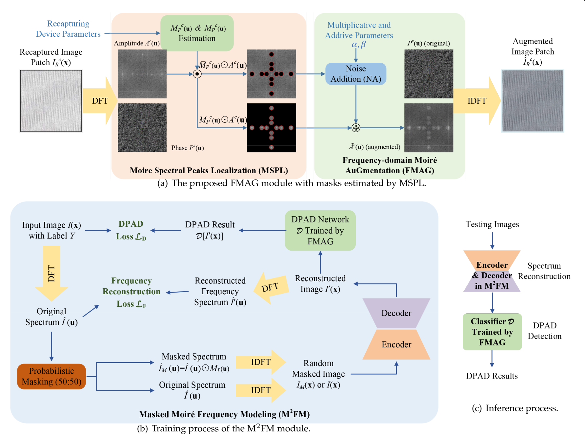

# Moiré Spectral Augmentation and Masked Frequency Modeling for Document Presentation Attack Detection
Our work has been accepted for publication in IEEE Transactions on Dependable and Secure Computing.



## Requirments

For environment setup, please follow the [MFM installation](https://github.com/Jiahao000/MFM/blob/master/docs/INSTALL.md).

## Dataset

### Training Data Preparation

We use  **DM** for training:
- 48 genuine document images
- 386 screen-recaptured images

You can download the dataset [here](https://pan.baidu.com/s/1cSHTpfrWxP8nUyHTRZOZ_g).  🔑Extraction code: `rtw1`

**Preprocessing Steps**:
1. Crop images into 224×224 patches.
2. Apply data-level oversampling:
   - Duplicate genuine samples
   - Maintain class balance
3. Please organise the training set as follows (0-legal; 1-recaptured):
```plaintext
DM/
├── images/
│   ├── 0/         
│   │   ├── HUAWEIP9_0009_1.tif
│   │   └── ...
│   └── 1/   
│       ├── IMG_20230521_231421_0_0.tif
│       └── ...
```

### Testing Data Preparation

We use **SRDID162** for testing. You can download the dataset [here](https://pan.baidu.com/s/1M2GYhMPQHe6af_gvGT1Z1w).   🔑Extraction code: `89kx`

## Frequency-domain Moiré AuGmentation (FMAG)
The FMAG is implemented in `FMAG.py` and run `python FMAG.py`.

## DPAD Network Trained by FMAG

### Training

1. Modify the data path, backbone type, and training parameters in `configs/config1.py`.
2. run `python main_backbone.py train`.

### Testing 
run `python main_backbone.py test`.

## Masked Moiré Frequency Modeling (M²FM).

1. Modify the `CSV_TRAIN_PATH`, `MODEL_FAG`, `MODEL_NAME` in `config.py`.
2. Please organise the training set as follows:
3. Run the training command.
```
python -m torch.distributed.launch --nproc_per_node=4 main_mfm_FAG.py
--cfg configs/vit_base/mfm_pretrain__vit_base__img224__300ep.yaml
--launcher="pytorch" --batch-size 36 --output ./output --tag experiment name
```

## Citation

If you find our work helpful in your research, please cite it as:

```
@ARTICLE{10981968,
  author={Chen, Changsheng and Li, Youjie and Li, Bokang and Yu, Weifan and Chen, Baoying and Li, Bin and Huang, Jiwu},
  journal={IEEE Transactions on Dependable and Secure Computing}, 
  title={Moire Spectral Augmentation and Masked ´ Frequency Modeling for Document Presentation Attack Detection}, 
  year={2025},
  pages={1-16},
}
```

## Acknowledgements

We would like to express our sincere gratitude to the authors of the MFM project for their invaluable contributions. The open-source code provided by the MFM team has been instrumental in the development of this project. 

Special thanks to the MFM team for their dedication to advancing research and providing a robust foundation for others to build upon. You can find their work here: [MFM GitHub](https://github.com/Jiahao000/MFM).

